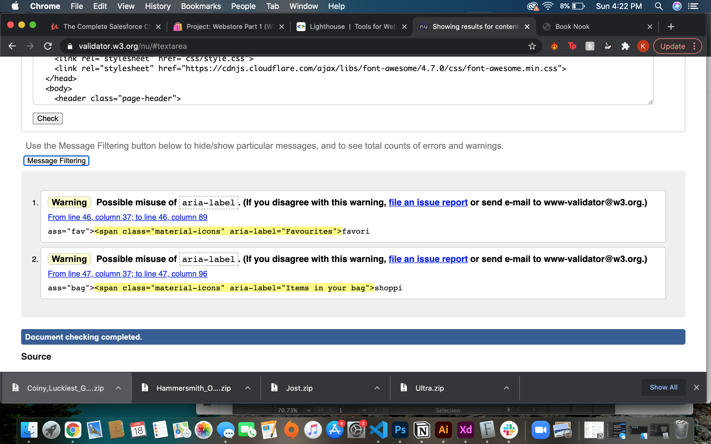
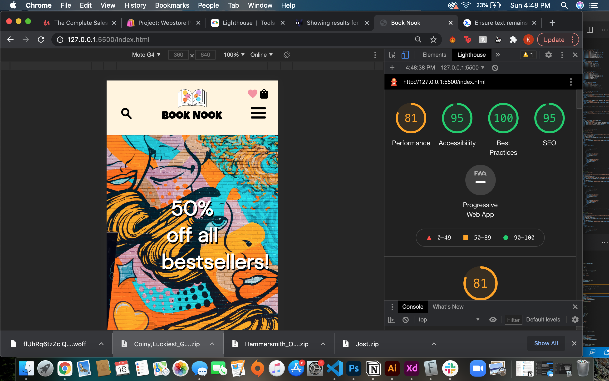

# Web Design & Development 1
## E-Comm Webstore: PART 2

### Outline

Read and complete the steps in the following two documents:

- [Content walk through](https://www.notion.so/juneate/Webstore-Part-2-Content-82e34001fca54aac93b7d1e9053a5927)
- [Styling walk through](https://www.notion.so/juneate/Webstore-Part-2-Style-b057567610534569b33fb5bfdb34ce6b)

### Submission

- This project will be uploaded to your personal Github account as a public repository
- Commits must be made prior to the due dates to be considered
- Github Pages must be activated on your site can be viewed live on the web
- The live url must be added to appropriate field of the repository's "About" (top-right)
- Both urls (code, and live) will be collected prior to the first deliverable being due
- See the [project overview](https://www.notion.so/juneate/Project-Webstore-28443f753b344d60b0176a24e14f17c9) for details on submissions, as well as a form
### Introduction

This website is an e-commerce website for books. There are 6 main JavaScript features, including: an array of 10 books, a method of adding the book array to the UI, a toggle menu for the smallest viewport, a search bar that filters and searches books by author and title, an image gallery on the product page and a cart tracker.

Happy shopping! Don't shop too hard!
### References

#### Search Bar: https://www.youtube.com/watch?v=v1PeTDrw6OY
#### Shopping Cart: https://www.youtube.com/watch?v=PoTGs38DR9E
#### Dropdown Toggle Menu: https://www.youtube.com/watch?v=bdft2MZEqJY
#### Book Covers: https://www.postermywall.com/index.php/sizes/book-cover-template#

##### The King of Drugs: Designed by David Watson
##### Sunset: Designed by Alien Coo
##### Left Alone: Designed by David Wa
##### A New Vision to Success: Designed by David Wa
##### The Baking Cookbook: Designed by David Wa
##### Rise Above Wilderness: Designed by David Wa
##### The Night Profecy: Designed by Marcus Aurelius Valerius Massentius
##### Secret Recipes: Designed by Sirle K
##### Drawn to the Sky: Designed by Sirle K
##### Ensaladas: Designed by Silvia
#### Suggested Book Covers

##### Green Hell: Designed by Marcus Aurelius Valerius Massentius
##### The Trucker: Designed by Paula
##### 72 Hours: Designed by David Wa
##### Ice Desert: Designed by Marcus Aurelius Valerius Massentius
##### Close to Home: Designed by DG
##### Away: Designed by Silvia
### Test Screenshots

